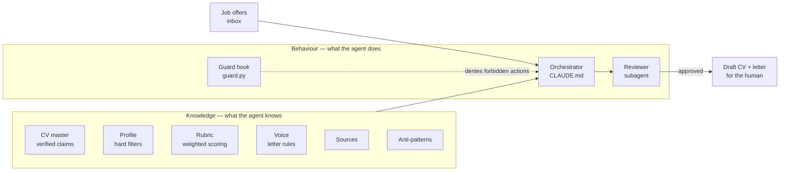

# Job-Search Agent — demo

An AI agent that reads job offers every morning, scores them against a written set of criteria and prepares a tailored CV and cover letter for the ones worth applying to. **The human decides and sends. The agent never sends anything.**

> This is a public, anonymised demo of a private system I built and run daily since August 2026. The candidate, **Alex Demo**, is fictional, and so are the example offers. The structure, rules and lessons are real.

---

## Why it is built this way

Four decisions shape everything in this repository:

1. **Knowledge is separate from behaviour.** What the agent *knows* (the candidate, the criteria, the voice) lives in one set of documents. What it *does* (the daily flow) lives in another. Either can change without breaking the other.
2. **The agent selects, it never writes claims.** The CV is broken down into verified, approved statements. The agent can choose and order them, but it cannot invent a new one. If nothing fits a requirement, it flags a gap instead of filling it.
3. **Rules that matter are barriers, not requests.** A rule written in a document is an instruction the model interprets. A hook is code that runs before every tool call and can deny it. The model does not take part in that decision.
4. **Test, don't trust.** Every barrier is checked by trying to break through it, and the scoring was calibrated against my own judgement before the system ran on its own.

## How it works

Each morning the orchestrator reads new offers, discards those that fail a hard filter, scores the rest, and drafts documents for the ones above the threshold. A reviewer subagent checks every draft against the written rules before it reaches me. A guard hook blocks the actions the agent must never take, such as sending an email.

## In numbers

| | |
|---|---|
| Knowledge documents | 8 |
| Hard filters | 10 |
| Weighted scoring dimensions | 6 |
| Security test battery | 6 tests |
| Build incidents documented, each with root cause and fix | 16 |

## Repository map

| Path | What it holds |
|---|---|
| `knowledge/` | The documents the agent reads before acting |
| `CLAUDE.md` | The orchestrator: the daily flow, step by step |
| `.claude/agents/` | The reviewer subagent |
| `.claude/hooks/` | The guard hook |
| `tests/` | The security test battery |
| `examples/` | Fictional offers and how the system scored them |
| `docs/incidents.md` | What broke during the build, why, and what changed |

*The folders are added step by step through pull requests. See the commit history.*

## Who did what

I designed the system: the knowledge base, the rules, the scoring criteria, the barriers and the test protocol. I wrote and maintain every document in it. The code (the guard hook and the GitHub Actions workflows) was written with Claude Code from the rules I defined. I can explain why each part exists and what it protects against, but I did not write the code line by line.

## Author

**Alex Demo** is fictional. The system was designed by Martí Roma, Barcelona.